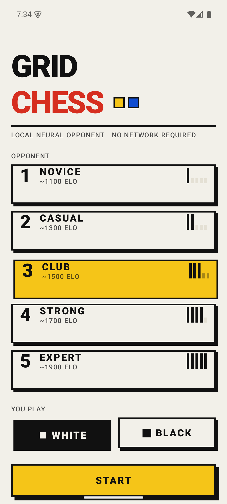
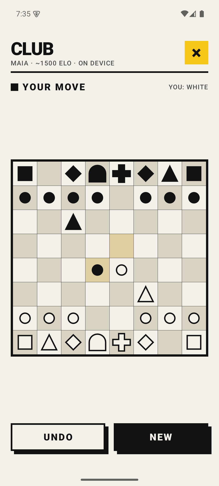
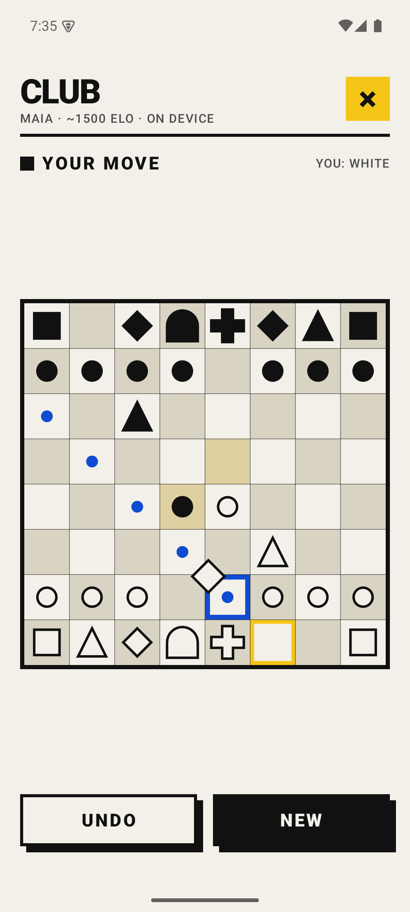

<h1>GRID CHESS</h1>

Chess against a neural network that runs entirely on the phone. No server, no
API key, no `INTERNET` permission in the manifest.

<p>
  <a href="../../releases/latest"></a>
  
  
</p>

<table>
  <tr>
    <td></td>
    <td></td>
    <td></td>
  </tr>
  <tr>
    <td align="center"><sub>Five nets, not one throttled five ways</sub></td>
    <td align="center"><sub>The Scotch, played by maia-1500</sub></td>
    <td align="center"><sub>Drag or tap-tap, both work</sub></td>
  </tr>
</table>

## The opponent

Five difficulty levels are five separate [Maia](https://github.com/CSSLab/maia-chess)
networks, each trained only on games played by humans in one rating band:

| Level | Name   | Net       | Elo band | Move choice        | Blunder guard |
|-------|--------|-----------|----------|--------------------|---------------|
| 1     | Novice | maia-1100 | ~1100    | sampled, T = 0.85  | off           |
| 2     | Casual | maia-1300 | ~1300    | sampled, T = 0.70  | off           |
| 3     | Club   | maia-1500 | ~1500    | sampled, T = 0.50  | off           |
| 4     | Strong | maia-1700 | ~1700    | sampled, T = 0.30  | on            |
| 5     | Expert | maia-1900 | ~1900    | argmax             | on            |

**There is no tree search.** One forward pass through the policy head picks the
move — measured at 4–8 ms on a Pixel 7, so the visible "thinking" pause is an
artificial 420 ms floor rather than real work.

That is the point. A depth-limited Stockfish is stronger, but its mistakes are
alien: it plays three brilliant moves and then hangs a rook for no reason a human
would recognise. Maia was trained to predict *the move a human of that rating
actually played*, mistakes included, so its errors are the ones you know from
your own games. Search would sand exactly that off.

The one concession is the blunder guard at levels 4–5, where a hung queen reads
as a broken app rather than a human mistake. It runs a capture-only three-ply
material probe over the top few policy moves and rejects the sampled move when a
near-equally-likely one is at least a minor piece sounder. Levels 1–3 have it off
on purpose — hanging pieces *is* the 1100–1500 experience.

## Design

Neo-brutalism on a Bauhaus vocabulary, and it goes all the way down to the
pieces: **king is a cross, queen an arch, rook a square, bishop a diamond, knight
a triangle, pawn a circle.** No lettering, no colour cue — silhouette alone
carries identity, and scale ranks it.

Everything is built from one primitive, `BrutalSlab`: a flat panel with a hard
black border and an unblurred offset shadow. Pressing drives the slab *into* its
own shadow instead of lifting it. Zero corner radius anywhere; the corner is the
statement. Colour is a signal, never decoration — one Bauhaus primary per screen
region, everything else ink on paper.

The theme is deliberately light-only. Neo-brutalism is a high-contrast
ink-on-paper idiom, and a dimmed variant of it reads as a bug rather than a mode.

Moves go in either way: tap the piece then the square, or drag it. Both feed the
same path — a drag start selects, a drop plays — so there is one set of move rules
to get wrong instead of two. The piece in hand stays centred on the finger rather
than raised above it: raising reads better under a thumb but splits what you see
from where it lands, so the blue frame around the pointer does the aiming instead.

## How the engine talks to the net

The fiddly part is lc0's input format, and two things in it are easy to get
wrong in a way that would never crash — the net would just quietly play worse.

**The 112 input planes** (`LeelaEncoder.kt`) are written from the moving side's
perspective: "ours" is always the mover, and for Black the board is rank-mirrored.
That holds for the eight history steps too — a position from one ply ago is
re-oriented into the *current* mover's frame rather than its own. Missing history
at the start of a game stays zero, matching how lc0 plays out from the start
position.

**The 1858-entry policy vector** (`PolicyIndex.kt`) is likewise written from the
mover's perspective, so Black's moves are rank-mirrored before lookup. And only
queen, rook and bishop promotions carry a suffix (indices 1792–1857); a knight
promotion is stored as the plain four-character move. There is no `a7a8n`.

Both are pinned by unit tests. `tools/verify_encoder.py` goes further: it mirrors
the Kotlin encoder in Python and diffs it against the tensor lc0 itself produces,
across openings, colour flips, castling changes and repetitions.

```
  ok     0 plies  (start)
  ok     1 plies  e2e4
  ok     6 plies  e2e4 e7e5 g1f3 b8c6 f1b5 a7a6
  ok    10 plies  d2d4 g8f6 c2c4 e7e6 g1f3 d7d5 b1c3 f8e7 c1g5 e8g8
  ok     6 plies  g1f3 g8f6 f3g1 f6g8 g1f3 g8f6
All positions match lc0
```

## Building

Requires JDK 21 and the Android SDK (platform 35, build-tools 35). On macOS:

```bash
brew install openjdk@21
brew install --cask android-commandlinetools
```

Then fetch and convert the networks — they are not committed, since they are
GPL-3 artefacts belonging to CSSLab rather than to this project:

```bash
brew install lc0
python3 tools/export_maia.py
```

That downloads the five `.pb.gz` weight files and runs each through lc0's
`leela2onnx`, landing them in `app/src/main/assets/models/`. Without them the app
still builds and runs — the engine falls back to random legal moves and logs the
failure — so the build never depends on the download.

```bash
./gradlew :app:assembleDebug
./gradlew :app:testDebugUnitTest
```

Release builds are signed from a `keystore.properties` in the project root
(gitignored). Without that file the release build still succeeds and simply comes
out unsigned.

APKs are split per ABI, because ONNX Runtime carries a ~17 MB native library for
each one. arm64-v8a comes out at 35 MB: 17 MB of runtime, 17 MB of nets, and
1.6 MB of everything else.

## Licence

GPL-3.0 — see [LICENSE](LICENSE) and [NOTICE](NOTICE).

The released APK embeds the Maia networks, which are GPL-3, and that licence
propagates to the whole binary. The source is licensed to match rather than
claiming a permissiveness the distributed artefact cannot have.

Maia is the work of [CSSLab at the University of Toronto](https://github.com/CSSLab/maia-chess)
— McIlroy-Young, Sen, Kleinberg and Anderson, *Aligning Superhuman AI with Human
Behavior: Chess as a Model System*, KDD 2020. This project only packages it for
Android; the interesting part is theirs.
