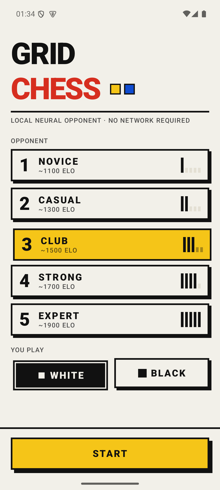
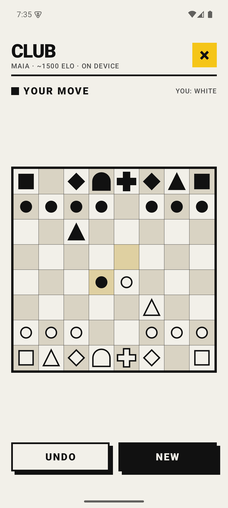
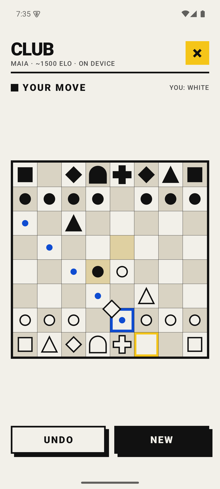

<h1>GRID CHESS</h1>

Chess against a neural network that runs on the phone. No server, no internet permission.

<p>
  <a href="../../releases/latest"></a>
  
  
</p>

<table>
  <tr>
    <td></td>
    <td></td>
    <td></td>
  </tr>
  <tr>
    <td align="center"><sub>Five levels, five nets</sub></td>
    <td align="center"><sub>The Scotch, played by maia-1500</sub></td>
    <td align="center"><sub>Drag or tap-tap</sub></td>
  </tr>
</table>

## Opponent

Each level is a separate [Maia](https://github.com/CSSLab/maia-chess) net, from maia-1100 to maia-1900. Maia was trained on human games in one rating band, so it makes the mistakes a player of that rating makes. There is no search: one forward pass picks the move in 4–8 ms.

Levels 4 and 5 check the top moves with a short capture probe, so the engine won't hang its queen. Levels 1–3 skip the check. At 1100–1500, people hang pieces.

## Design

Neo-brutalism with Bauhaus shapes. The king is a cross, queen an arch, rook a square, bishop a diamond, knight a triangle, pawn a circle. Move by tapping or dragging.

## Build

```bash
brew install openjdk@21 lc0
brew install --cask android-commandlinetools
python3 tools/export_maia.py   # downloads the nets and converts them to ONNX
./gradlew :app:assembleDebug
```

Without the nets the app still builds and plays random legal moves. Release signing reads `keystore.properties` from the project root.

## Licence

GPL-3.0, because the bundled Maia nets are GPL-3. See [LICENSE](LICENSE) and [NOTICE](NOTICE). Maia is by [CSSLab, University of Toronto](https://github.com/CSSLab/maia-chess): McIlroy-Young, Sen, Kleinberg, Anderson, KDD 2020.
